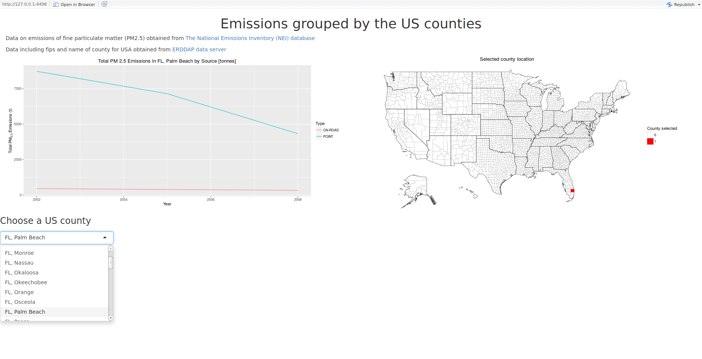

Fine particulate matter emission in counties of USA
========================================================
author: Oksana Volnianska
date: 25.03.2016
transition : rotate
<div class="reveal">

About application
========================================================
<li style="color:red">This app is showing the PM25 emission by source type across the United States counties that are located on US choropleth.</li>

Fine particulate matter (PM2.5) is an ambient air pollutant for which there is strong evidence that it is harmful to human health. Environmental Protection Agency (EPA) releases its database on emissions of PM2.5 for the USA. For each year and for each type of PM source, the data records show how many tons of PM2.5 were emitted. The data set was obtained from https://d396qusza40orc.cloudfront.net/exdata%2Fdata%2FNEI_data.zip and
contains the data for the folowing years: 1999, 2002, 2005,and 2008. The data set includes
fips and names of counties in USA obtained from RDDAP data server
http://coastwatch.pfeg.noaa.gov/erddap/convert/fipscounty.html .


Libraries used in the app
========================================================


```r
library(shiny)
library(sqldf)
library(tcltk)
library(ggplot2)
library(choroplethr)
library(choroplethrMaps)
```
<li> shiny package facilitates making web app for R</li>
<li> sqldf, tcltk packages use SQL for R data.frame</li>
<li> ggplot2 package for making plot in app R</li>
<li> choroplethr, choroplethrMaps packages for making geographic map of the US</li>

Example  data set for selected county
========================================================
getCountyEmissions() function build query uncluding the data 
from two based data sets (see Page 2 of a presentation).

```r
getCountyEmissions <- function(name) {
  code <- subset(c_unique, county==name)$fips
  sql_query <-paste("SELECT year as Year, type as Type, county,                     sum(Emissions) as Emission, fips FROM NEI JOIN fcc USING (fips) WHERE fips =",as.character(code)," GROUP BY fips, year, type")
  out<-sqldf(sql_query)
  return(out)
}
```
It is example data for county = "FL, Palm Beach":

```r
res <- getCountyEmissions("FL, Palm Beach")
head(res)
```

```
  Year     Type         county  Emission  fips
1 1999 NON-ROAD FL, Palm Beach  1089.580 12099
2 1999 NONPOINT FL, Palm Beach 12922.389 12099
3 1999  ON-ROAD FL, Palm Beach   503.570 12099
4 1999    POINT FL, Palm Beach 10625.349 12099
5 2002 NON-ROAD FL, Palm Beach  1443.606 12099
6 2002 NONPOINT FL, Palm Beach 10493.970 12099
```

Using the app
========================================================

Specifiy the following using dropdown box: county


This applet was made as a project for Coursera's class on Developing Data Products. 
It was written in R and hosted by shiny apps at https://ksusa.shinyapps.io/PMEinUSA
